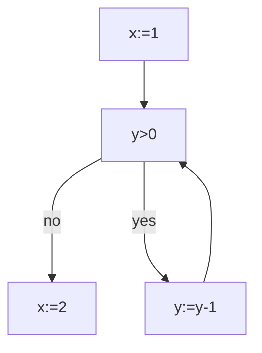

# Live Variable Analysis

This project is an implementation of live variable analysis, a technique used in compilers to determine the
variables that are still in use at a certain point in a program's execution. The goal of live variable
analysis is to optimize the code by identifying and removing dead code, which can improve the performance
and reduce the memory footprint of the generated executable.

## Implementation and Running the Analysis

The implementation of live variable analysis in this project uses a data flow analysis algorithm to track
the flow of variables through the program. The algorithm takes into account the control flow of the program
and the use and definition of variables at each program point. The analysis is performed on the
intermediate representation of the program, such as a [control flow graph](https://en.wikipedia.org/wiki/Control-flow_graph).

The algorithm used in this project is based on the iterative data flow analysis method, where the analysis
is performed in multiple passes over the program until a fixed point is reached. This implementation was done in
Haskell and uses a map structure to represent the live variables at each program point.

To run the analysis:

```bash
cabal install
cabal run
```

### Expressions

An Arithmetic Expression is given by the following syntax: e ::= n | x | e1 + e2 | e1 - e2 | e1 \* e2

```haskell
data AExpression
  = Literal Int
  | Variable String
  | Add AExpression AExpression
  | Sub AExpression AExpression
  | Mul AExpression AExpression
```

For example, the arithmetic expression "x + 1" is represented as: `Add (E.Variable "x") (E.Literal 1)`

A Boolean Expression is given by the following syntax: b ::= e1 ≤ e2 | e1 = e2 | b1 ∧ b2

```haskell
data BExpression
  = Leq AExpression AExpression
  | Equal AExpression AExpression
  | And BExpression BExpression
```

For example, the boolean expression `x <= 1` is represented as: `Leq (E.Variable "x") (E.Literal 1)`

## Representation of the Control Flow Graph

In this implementation, programs are encoded into a CFG, where the basic blocks are assignments and boolean expressions. Each basic block will contain a unique label. In live variable analysis, the process receives a program’s Control Flow Graph (CFG) and yields, for every block in the CFG, the set of live variables before and after that block.

Here is an example in [While](https://www.cs.cmu.edu/~aldrich/courses/15-819O-13sp/resources/while-language.pdf):

```while
x := 1
while y > 0 do
    y := y - 1;
    x := 2;
```



A Control-Flow Graph (CFG) is a list of blocks. Blocks can be either assignments or conditional. In this
implementation, we use the following data structures:

```hs
type CFG = [Block]

data BlockType
  = Skip
  | Assignment String E.AExpression
  | Conditional E.BExpression
```

For instance, the assignment `x = 1` can be represented as: `Assignment (Add (E.Variable "x") (E.Literal 1)`

A block from the CFG is represented as a record than contains a block (block type), an outLink (exit blocks) and the label. In this implementation, each block is represented according to the following data structure:

```hs
data Block = Block
  { block :: BlockType,
    label :: Int,
    outLink :: [Int]
  }
```

For instance, the block "1" can be represented as the following record:

```
---------
| x = 1 |---> Block 3
---------
   |
Block 2
```

The block "1" can be represented as the following record:

```hs
Block
  { block: Assignment (Add (E.Variable "x") (E.Literal 1))
    label: 1
    outLink: [2, 3]
  }
```

## Data Flow Equations

For this analysis, we compute the following set of variables:

- $LVIn_n$: Live variables at the entry of block n. For this, we use the transfer function:

  $VIn_n = (LVOut_n − Kill_n) \cup Gen_n$

  where $Gen_n$ are variables that are read in block n, and $Kill_n$: are Variables that are written to in block n.

- $LVOut_n$: Live variables at the exit of block n. A variable is live at the exit of a block if it is live
  at the entrance of any of the blocks following it. For instance, the block 1:

  ```
  ---------
  | x = 1 |---> Block 3
  ---------
    |
  Block 2
  ```

  The $LVout_1$ equation is: $LVOut_1 = LVIn_2 U LVIn_3$

### Solution of the Equation System

The result is a system of equations whose unknown variables are $(LVOut_1, LVOut_1, ..LVIn_n)$. The
solutions of this system are the fixed points of F, which is the supremum of the ascending [Kleene chain](https://en.wikipedia.org/wiki/Kleene_fixed-point_theorem).

1. We obtain the Kleene chain, starting with a empty set for all LVIn and LVOut

   ```hs
   LV' = Map (1, LV { LVIn=empty, LVOut=empty })
   ```

2. We get the new variable using this point

   ```hs
   LV'' = getLV LV' ...
   ```

We repeat (1) and (2) until the LV of the previous point is equal to the LV of the current point.

For this, we create an infinite list that will return its values when the previous condition is met. The
result of the analysis is the last element of the list, which represents the supremum of the ascending [Kleene chain](https://en.wikipedia.org/wiki/Kleene_fixed-point_theorem).

## Example

Complete example using the [While](https://www.cs.cmu.edu/~aldrich/courses/15-819O-13sp/resources/while-language.pdf) language:

```while
x := 1
while y > 0 do
    y := y - 1;
    x := 2;
```

Graphical representation of the control flow graph:


Representation of the control flow graph in this implementation:

```hs
let block1 = G.Assignment "x" (E.Literal 1)
let block2 = G.Conditional (E.Leq (E.Literal 1) (E.Variable "y"))
let block3 = G.Assignment "x" (E.Sub (E.Variable "x") (E.Literal 1))
let block4 = G.Assignment "x" (E.Literal 2)
let graph =
  [
    G.Block {G.label = 1, G.outLink = [2], G.block = block1},
    G.Block {G.label = 2, G.outLink = [3, 4], G.block = block2},
    G.Block {G.label = 3, G.outLink = [2], G.block = block3},
    G.Block {G.label = 4, G.outLink = [], G.block = block4}
  ] :: G.CFG
```

Live Variable Analysis result:

```
LVIn1=["y"] LVOut1=["x","y"]
LVIn2=["x","y"] LVOut2=["x","y"]
LVIn3=["x","y"] LVOut3=["x","y"]
LVIn4=[] LVOut4=[]
```

## Acknowledgment

Assignment from "Static Program Analysis and Constraint Solving" at Universidad Complutense de Madrid. Prof. Manuel Montenegro.
